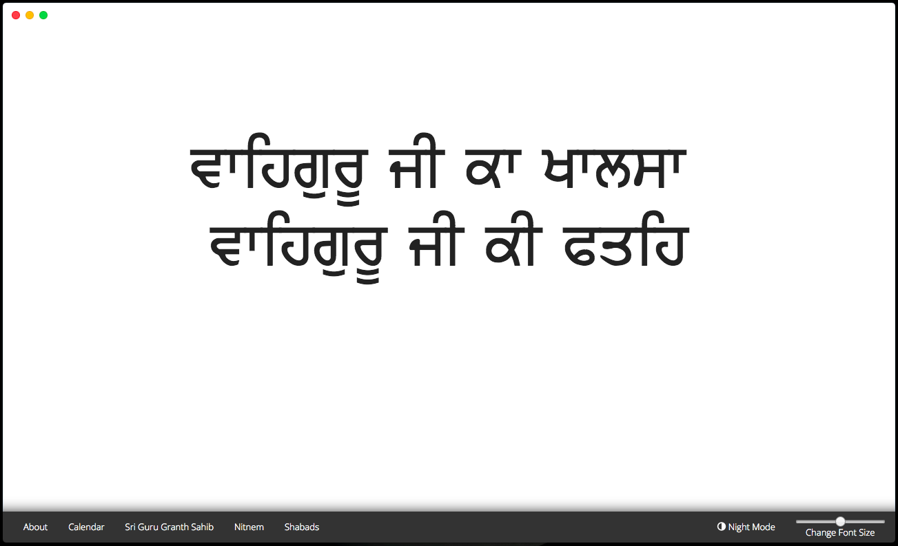
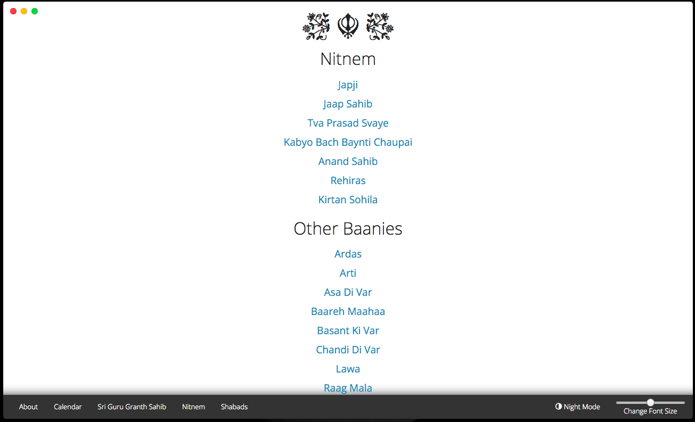
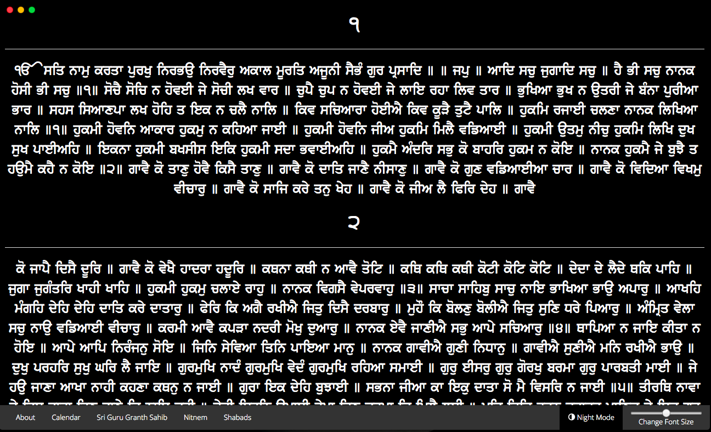

SikhJS v0.0.3b
==
Modern Gurbani application for Windows, OSX and Linux. Built on Electron.
**NOTE**: The application is still in active development and is not fit for public release just yet.





Goal
==
I've added several new goals and roadmap. Would love some support to make this a reality.
* Create a multiplatform Gurbani application with lightweight modern design.
* Provide a clean way of representing Baani on Web (Usage of markdown files)
* Promote it among youth.

Why ?
==
Well I'm a Sikh and I happen to be a web developer, so I saw an opportunity to use my skills to serve to my fellow Sikh brothers and Sisters.
Apart from that, the main reason behind the project is that the Baani softwares are of 1990s era in 2015s.
They are in dire neeed of a revamp, and this I believe is the first step towards a modern revolution for Sikhism, when youth uses technology to
learn more about Baani and Sikhism.

How ?
==
The application is very simple as of now. I've manually taken docs from [SikhNet] (http://www.sikhnet.com/DownloadBanis)
and converted them to markdown files. The reason why I chose them is because they are
  * very lightweight
  * can be parsed to HTML very easily
  * is pretty widely supported

A CSS class `gurbani-text` is used to use proper [Gurmukhi Fonts] (/dist/fonts/) for text having Gurbani.

Build
==
The project is based on Electron. You can build it as follows:

## Prerequisites
  * [NodeJS v4.0.0 or higher] (https://nodejs.org)

## Instructions
```bash
# Installation
git clone https://github.com/bogas04/SikhJS.git
cd SikhJS
npm i
npm i electron-packager -g

# Transpile JSX to JS during development
npm run build
# Transpile JSX to JS during development and watch the files
npm run buildw
# Transpile and start the app
npm run start

# Package
npm run package-(darwin|win32|linux)
```

Changelog
==
## v2.5.0
  - [ ] Social Aspect
    - [ ] /r/Sikh column for discussion
    - [ ] Twitter? GooglePlus? WhatsApp? Telegram?
  - [ ] Gurudwara finder
    - [ ] Curated by availability of langar, rooms, etc

## v2.0.0
  - [ ] Gurmukhi
    - [ ] Pronunciation of the words.
    - [ ] Definition of words. Select a word and `CMD-D` \ `CTRL-D` to get its meaning
  - [ ] Notifications
    - [ ] Random Baani and its meaning
    - [ ] Nitnem Alert (With stats like "It took you 15 minutes to do Japji yesterday. You can spare that much time")
    - [ ] Calendar Alert
    - [ ] Breaking Sikh News

## v1.5.0
  - [ ] Saakhis
    - [ ] Need to add credible Saakhis which actually do akaal ustat and detach from physical form of Gurus
    - [ ] Picture Gallery
  - [ ] Redefine shabads on internet
    - [x] Proper searching (SearchGurbani can help)
    - [ ] Introduction to all forms and styles
    - [ ] SoundCloud integration for Shabads
    - [ ] YouTube integration for Shabads

## v1.0.0
  - [ ] Go service-worker website
  - [ ] Go react-native
    - [ ] android
    - [ ] iOS 

## v0.5.0
  - [x] Go react
    - [ ] Optimize Components
  - [ ] Keyboard shortcuts to hover through lines **check keyboardShortcuts branch**
  - [x] Sri Guru Granth Sahib
    - [x] Ang numbers
    - [x] Quick select angs
    - [ ] Sehaj Path tracker
      - [ ] Find a way to keep data persistent even with version updates.
  - [x] Sikh calendar
    - [x] Beautify
    - [ ] Add images
  - [x] Complete Gurmukhi Nitnem
  - [x] Baanis stored as markdown files for easier parsing

Credits
==
Thanks to
* SikhNet for the actual [Baanies] (http://www.sikhnet.com/DownloadBanis)
* [GurbaniFiles.org] (http://www.gurbanifiles.org/)
* [SearchGurbani.com] (http://searchgurbani.com/)
* and everyone else who are making this possible.

Contribute
==
You can contribute by
* Becoming a code-collaborator
* Becoming a content-collaborator
* Suggesting modern designs for the application
* Finding bugs

License
==
MIT
